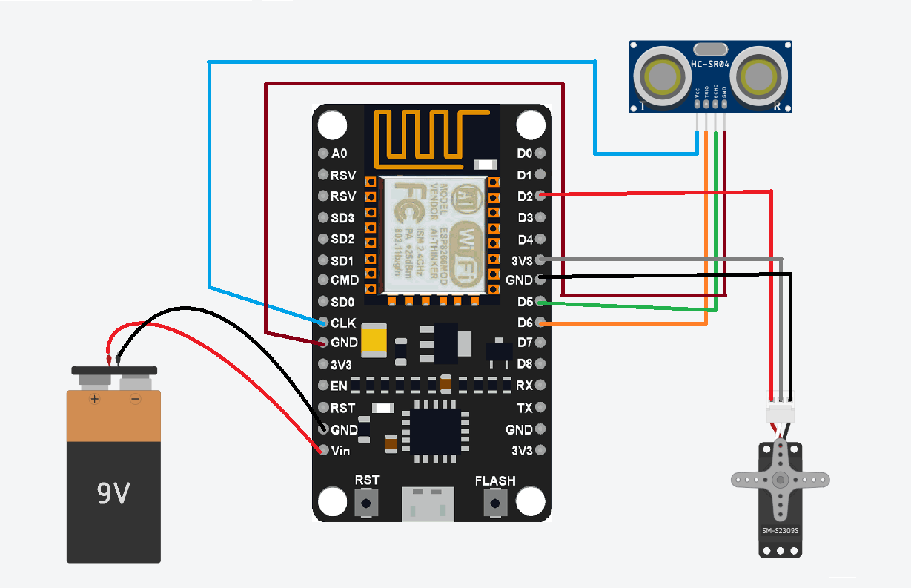
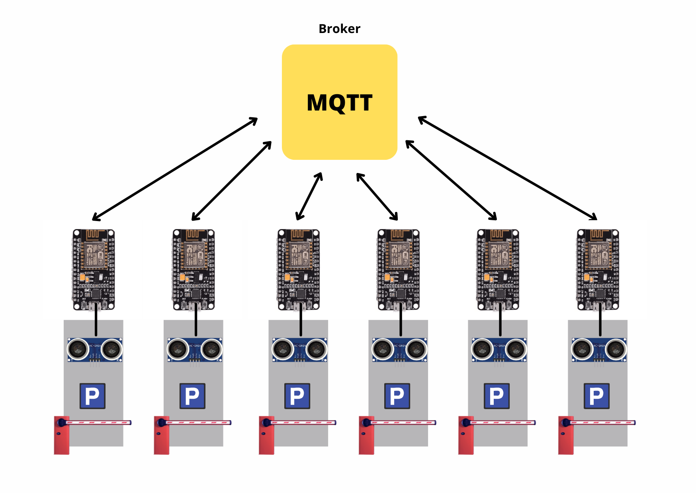

# ACP_IOT

Each parking space has one Esp8266 that is connected to ultrasonic for scanning and detecting the parking space as well as a barrier for reservation purposes. 

Ultrasonic identifies any vehicle within 50 cm and labels the space as unavailable, if it is greater than that, and it is vacant. If sensor detects an object in less than 10 cm, then there is a problem with the sensor and it has to be examined because it may has broken down or there is dirt that needs to be cleaned. Every ESP8266 subscribed to the topic corresponding to its unique id for receiving the request to open barrier.

Every 5 seconds, each ESP8266 at each parking place provides the status of the parking space, which is received by a broker in the cloud using the MQTT protocol.

All the IoT components were established and ready to be attached to parking spaces. With sensors to detect availability. Data is transmitted and device is communicating using MQTT protocol.

